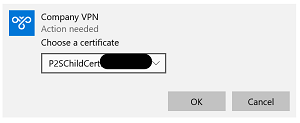

# Azure VPN Point-to-Site (P2S) Manual Setup for Windows 10

A Point-to-Site (P2S) VPN gateway connection lets you create a secure connection to your virtual private network from your Windows 10 computer.

## About Certificate-based Authentication

Connecting to your VPN requires authentication using a password-protected client certificate that must be present on your computer.

The validation of the client certificate is performed by the VPN gateway and happen while establishing a connection.

## What You'll Need

Before getting started, please make sure you have the following ready:

1. The **client certificate** (ending with *.pfx*) you were provided. This certificate is unique to you and your device.

1. The **client certificate name** (i.e., `P2SChildCert[MyCompany][Network][MyName]`) you were provided.

1. The **client certificate password**. You will be required to enter the password when installing the certificate.

1. The **VPN server address**. For example, `azuregateway-593744ba-1721-4ca5-a1cc-d71e12c89eaa.vpn.azure.com`. We recommend having this in a place you can copy from to avoid typing errors.

1. The list of **VPN connection routes**. For example, `10.1.0.0/16, 10.2.0.0/16`. In most cases, only one route is required. Note, you may have received a prepared file (ending with *.ps1*) that you can run to automatically configure your VPN connection routes in [Step 3: Add VPN Connection Routes](#step-3-add-vpn-connection-routes).

## Step 1: Install Your Client Certificate

Each client computer must have a client certificate installed on the device. Follow the steps in this section to install a client certificate.

1. Locate and copy the *.pfx* file to a convenient location on your computer where you can easily access it.

1. Once the file is on your computer, **double-click** the *.pfx* file to install it. The *Certificate Import Wizard* will appear.

1. Leave the **Store Location** as **Current User**, and then click **Next**.

    

1. On the **File to Import** page, don't make any changes. Click **Next**.

    

1. On the **Private key protection** page, input the password for the certificate, then click **Next**.

    

1. On the **Certificate Store** page, leave the default location (*Automatically select the certificate store based on the type of certificate*), and then click **Next**.

    

1. Click **Finish**. On the **Security Warning** for the certification installation, click **Yes**. The certificate is now successfully installed on your device.

## Step 2: Add a VPN Connection

**Tip:** The pane to add a VPN connection will block your view of other windows. Go ahead and copy (Ctrl+C) the **VPN server address** to the clipboard before starting this section so can easily paste (Ctrl+V) into the appropriate field.

1. Type `VPN Settings` in the search box on the taskbar, then select **VPN Settings**.

    

1. On the VPN Settings screen, click **Add a VPN connection**.

    

1. In the window that appears, select **Windows (built-in)** as the **VPN provider**.

    

1. Enter a **Connection name** of your preference (i.e., `Company VPN`). Be sure you do *not* include spaces before or after the Connection name.

    

1. Enter the **VPN server address** in the **Server name or address** field.

    

1. Leave **VPN type** set to **Automatic**.

1. For **Type of sign-in info**, select **Certificate**.

    

1. Leave the **User name (optional)** and **Password (optional)** fields blank.

1. Leave **Remember my sign-in info** enabled (checked).

1. Click **Save**.

1. On the **VPN Settings** page, click your new VPN connection (i.e., `Company VPN`), then click **Connect**.

    

1. Windows will attempt to establish a connection and then prompt you to choose a certificate.

1. Select the name of the certificate you installed (i.e., `P2SChildCert[MyCompany][Network][MyName]`) during [Step 1: Install Your Client Certificate](#step-1-install-your-client-certificate), then click **OK**.

    

1. You may see a **Continue connecting?** prompt stating that Windows does not have enough information to validate the server. Click **Connect**. You should only see this prompt the first time you connect.

    

1. The VPN status will change to *Connected*. You may lose your Internet connection while connected to the VPN until you complete [Step 3: Add VPN Connection Routes](#step-3-add-vpn-connection-routes).

    

1. Click **Disconnect**. Stay on the **VPN Settings** screen to continue to [Step 3: Add VPN Connection Routes](#step-3-add-vpn-connection-routes).

## Step 3: Add VPN Connection Routes

VPN Connection Routes instruct your computer to route network traffic to a specific VPN connection when the destination matches a *DestinationPrefix* parameter (a particular set of IP addresses).

### Option A: Run the VPNConnectionRoutes.ps1 PowerShell Script

1. If you've received a prepared VPN configuration file (ending with *.ps1*), right-click the file, then click **Run with PowerShell**.

    

2. A Windows PowerShell window will appear prompting for the **VPN connection name**. Enter the same VPN connection name (i.e., `Company VPN`) you created in [Step 2: Add a VPN Connection](#step-2-add-a-vpn-connection).

    

3. **Press any key** to close the window once the process completes. The *DestinationPrefix* may differ from the example below.

    

4. If you encounter errors, check connection name. It *must* match exactly to the name you provided when you created the VPN connection. It may not be apparent if you included a space after or before the name when typing it. It's safe to close the window, and repeat steps 1-3 above using the correct name. If the errors persist, please see [Getting Support](./README.md#getting-support).

    

### Option B: Add the VPN connection routes manually with PowerShell

If you did *not* receive a prepared VPN configuration file (ending with *.ps1*), you will need to run the following commands manually in a PowerShell console. You can copy and modify the example below or download the [example script](./examples/VPNConnectionRoutes.ps1) and follow the instructions in the script to configure it for your VPN connection.

If you are not comfortable with running commands in the PowerShell console, please contact the Support Desk for a prepared VPN configuration file. See [Getting Support](./README.md#getting-support).

```powershell
# We'll use the connection name multiple times, so set it as a variable.
# Replace 'Company VPN' with the same name you used when you created the VPN connection.
$ConnectionName = "Company VPN"

# For each VPN connection route you received from the Support Desk, run the following command. 
# Replace the value for -DestinationPrefix with the IP address you received from the Support Desk.
# For most customers, there is only one route to configure.
Add-VpnConnectionRoute -ConnectionName $ConnectionName -DestinationPrefix "10.1.0.0/16" -PassThru

# After adding all routes, running the following command.
Set-VpnConnection -Name $ConnectionName -SplitTunneling $True
```

## Step 4: Connecting to Your VPN

Once the previous steps are completed, you are ready to begin using your new VPN connection.

1. Click the **network icon** on the Windows task bar. You may see an Ethernet (as shown below) or Wi-Fi symbol depending on your network settings.

    

2. Find and click the VPN connection (i.e., `Company VPN`) in the Network pane.

    

3. Click **Connect**.

    

4. The status of the VPN connection will update to *Connected*. You may proceed accessing available resources on your virtual private network.

    

## Step 5: Disconnecting to Your VPN

1. Right-click the **network icon** on the Windows task bar.

    

2. Click the VPN connection (i.e., `Company VPN`).

    

3. Click **Disconnect**. The VPN connection will disconnect.


